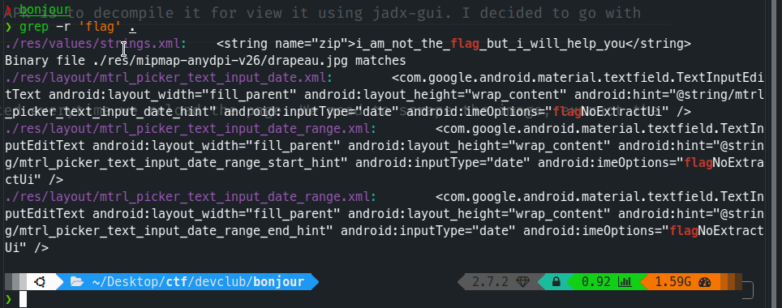

# Bonjour

# Requirements

- apktool
- unzip

# Description

```
Sometimes things are not what they appear!

Apk: https://devctf-binaries.s3.ap-south-1.amazonaws.com/apks/bonjour.apk
```

The first step for reversing any android APK is to decompile it for view it using jadx-gui. I decided to go with the former one for this step.



# Observation

Note : `res/values/strings.xml:    <string name="zip">i_am_not_the_flag_but_i_will_help_you</string>`

We can see that binary file `drapeau.jpg` matches in the directory, let's see what this kid got!

Let's run strings over it,

```
❯ strings drapeau.jpg | grep flag
flag.txt
flag.txt
```

Seems like there's some embedded data inside this image. This has been a common trend to hide zip in images, so let's try unzipping the file. 

```
❯ unzip drapeau.jpg 
Archive:  drapeau.jpg
warning [drapeau.jpg]:  185099 extra bytes at beginning or within zipfile
  (attempting to process anyway)
[drapeau.jpg] flag.txt password: 
```

# Exploitation

So this zip is password protected. I tried zip2john and rockyou.txt to crack this wordlist after extracting using binwalk, but of no use. Then I remembered, there was some text when we grepped for flag `i_am_not_the_flag_but_i_will_help_you`. I tried it as password, and it handed me over the flag peacefully!


Flag: ```ctf{voici_le_drapeau}```
