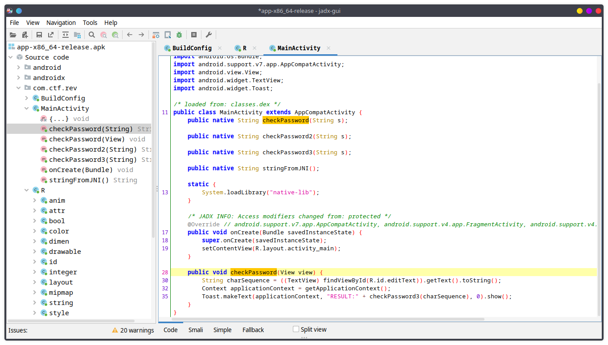
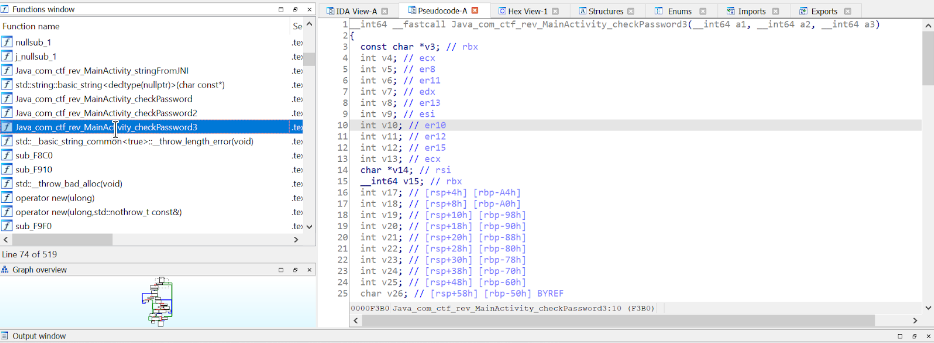

# Pinbreak

# Requirements

- unzip
- apktool
- jadx-gui

# Description

```
You Do Not have to pay to solve this.

Link: https://devctf-binaries.s3.ap-south-1.amazonaws.com/apks/release_new.zip
```

I fired up the one of the apks `app-x86_64-release.apk` in JADX-GUI and started reversing com.ctf.rev.MainActivity. So, here we have a function named `checkPassword` which was verifying password entered by the user.



# Observation

We can see that there's no function names checkPassword3 in the decompiled version. Let's decompile it using `apktool d  app-x86_64-release.apk`

Here, we have a shared library named `libnative-lib.so` in app-x86_64-release/lib/x86_64 directory. Let's open it up in IDA. On searching for the function named `checkPassword3`



Let's dump all of these equations in z3, and solve it

# Exploitation

```py
from z3 import *

eqn = Solver()

input_str = [BitVec(f"{i}",32) for i in range(20)]

v4 = input_str[14]
v5 = input_str[3]
v23 = input_str[11]
v31 = input_str[6]
v6 = input_str[7]
v13 = input_str[1]
v7 = input_str[5]
v26 = input_str[4]
v30 = input_str[9]
v25 = input_str[10]
v24 = input_str[18]
v28 = input_str[17]
v12 = input_str[16]
v8 = input_str[0]
v9 = input_str[15]
v27 = input_str[2]
v29 = input_str[19]
v10 = input_str[8]
v11 = input_str[12]

eqn.add(2 * v31 - v23 == 125)
eqn.add(v23 * v6 == 6745)
eqn.add(v7 - v26 - v31 == -168)
eqn.add(v5 + v4 + v23 * v4 == 11451)
eqn.add(v25 == 102)
eqn.add(v28 + v7 + v24 == 203)
eqn.add(v8 + v26 * v28 == 5770)
eqn.add(v24 + v4 * v25 * v30 == 577829)
eqn.add(v24 * v5 + v10 + v9 == 12569)
eqn.add( v7 * v5 + v7 - v5 == 5953)
eqn.add( v6 + v23 * v29 * v27 == 1211321)
eqn.add(v6 + v24 - v7 == 123)
eqn.add( v4 + v30 + v8 * v5 == 12343)
eqn.add(v9 + v24 == 152)
eqn.add(v8 * v4 * v5 == 1436886)
eqn.add(v5 + v27 == 225)
eqn.add(v8 == 99)
eqn.add(v8 * v4 + v4 + v30 == 11848)
eqn.add(v30 + v8 + 2 * v25 == 351)
eqn.add(v11 - v25 * v5 == -12464)
eqn.add( v7 - v7 * v12 * input_str[13] == -284837)
eqn.add(v29 + v28 - v11 * v5 == -9908)
eqn.add(v8 + v25 * v30 == 4995)
eqn.add(v11 + v25 - v28 == 131)
eqn.add(v8 + v11 - v24 == 80)
eqn.add(v4 - v4 * v5 == -14396)
eqn.add(v12 == 114)
eqn.add(v30 - (v7 + v24) == -102)
eqn.add(v27 == 102)
eqn.add( v24 - v26 * v23 == -10064)
eqn.add(v24 * v29 - v8 == 12526)
eqn.add(v28 * v7 * v27 == 264894)
eqn.add( v31 + v23 * v11 == 7900)
eqn.add(v9 + v26 - v23 == 63)
eqn.add(v7 + v25 - v13 == 35)
eqn.add(v25 + v24 * v7 * v9 == 252501)
eqn.add( v29 + v7 - v10 == 79)
eqn.add(v27 + v12 + v26 * v10 == 10381)
eqn.add(v12 * input_str[13] + v26 + v13 == 6037)

eqn.check()
m = eqn.model()

bitvec_char = sorted([(d,m[d]) for d in m],key=lambda x: int(str(x[0])))
ascii_bytes = [str(i) for _,i in bitvec_char]
flag = ''.join([chr(int(i)) for i in ascii_bytes])

print(flag)
```

Flag: ```ctf{k1nG_0f_R3v3r5e}```
