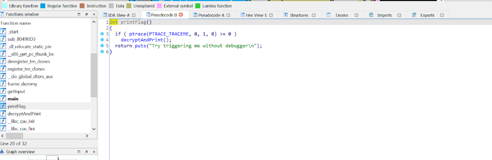

# Excess Chars

Seems like a simple buffer overfow challenge from the name.

I opened up `IDA` for decompiling the program and went straight to the main function. Here's the useful code

```c
int __cdecl __noreturn main(int argc, const char **argv, const char **envp)
{
    getInput();
    putchar(10);
    exit(0);
}
```

There's also a suspicious function `printFlag`. On decompiling it, we get the following pseudo code:



- This function won't allow me to use a debugger. Our target is to either call the `printFlag` function or the `decryptAndPrint` function.

- Calling the decryptAndPrint() directly with the use of gdb prints gibberish as the flag, for some reason.

- At this point, it felt like there was no where to go, because I didn't use any debugger except gdb for binaries.

- I realized that I can always the modify the values from GDB, be it the case of checking if we're using debugger or not.

- I changed the flag variable used to trigger the `if` condition by setting `$(eax) to 0`

Note: I also read something about [PTRACE bypass](https://gist.github.com/poxyran/71a993d292eee10e95b4ff87066ea8f2) here. 
## Exploit

```c
(gdb) p ($eax)
$1 = -1
(gdb) set ($eax)=0
(gdb) p ($eax)
$2 = 0
(gdb) n
Single stepping until exit from function ptrace,
which has no line number information.
printFlag () at crackme2.c:25
25	in crackme2.c
(gdb) n
Maybe you are in the right path ??

Flag you got is : 3xpl0!t_Rev3rs!nG_3G
```

So yeah, now we have the flag: `CTF{3xpl0!t_Rev3rs!nG_3G}`
