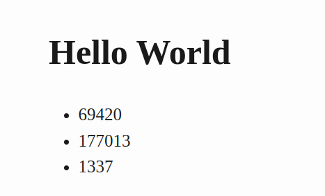
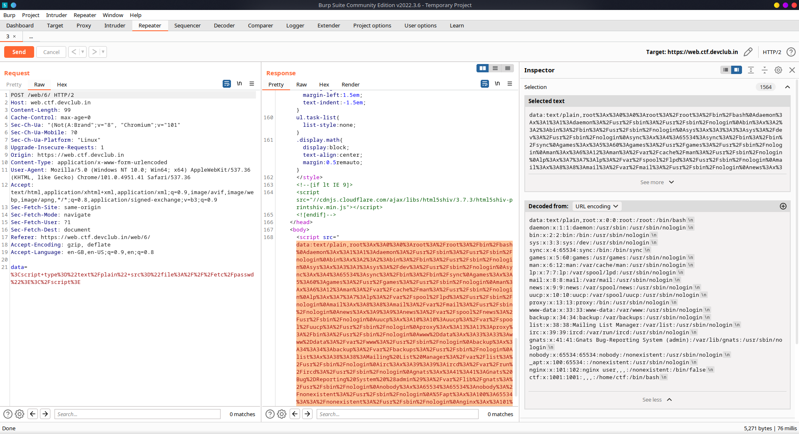
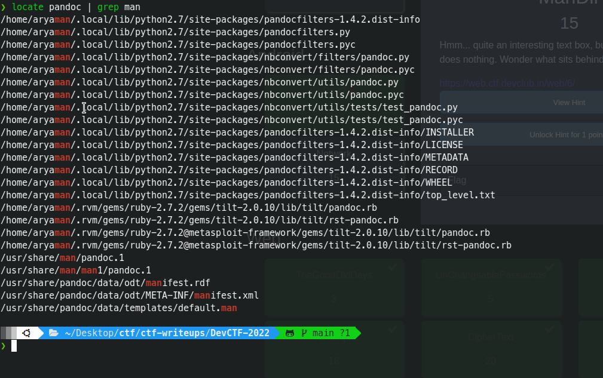
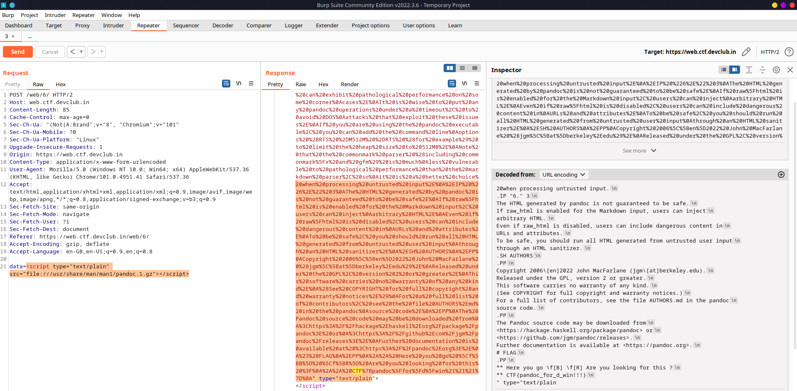

# ManDir

# Description

```
Hmm... quite an interesting text box, but one that seemingly does nothing. Wonder what sits behind it.

https://web.ctf.devclub.in/web/6/
```

This was an awesome challenge by the organizers, which required the platers to look around and experiment 
with the suspicious textbox which seemed to do nothing.  

# Observation

The welcome page says `I am Pandoc, Send me something to Eat`. What's this new thing called Pandoc that I've never heard of? On looking up for it, I found that *Pandoc is a Haskell library for converting from one markup format to another, and a command-line tool that uses this library.* 

Hmm...interesting? I tried entering the following text to confirm my understanding

```
# Hello World
* 69420
* 177013
* 1337
```

It resulted in: 



I soon found out that it was rendered with Pandoc as it stands in the webpage source and that we could enter an external source to be contained in the rendered output. For instance, if we submit a script tag with our controlled URL, we could see the content of the URL in the response from the server. This means, the request takes place on the server and not on the client. The Pandoc documentation refers to this as the `—self-contained` option.

# Exploitation

We tried inputting 
```js
<script type="text/plain" src="file:///etc/passwd"></script>
``` 
Oh yeahhh...!! Seems like we have arbitray file read on the system:



Now that we have LFI in the server, where should the flag be? I tried searching in some common files to search during recon, but didn't get anything special. Then a thought striked me regarding the challenge name `ManDir`
which might mean the flag is in a directory where the man pages reside?? Let's look where do the files of pandoc reside. 



We see that here's a gz file named `/usr/share/man/man1/pandoc.1.gz`

# Final payload
```js
<script type="text/plain" src="file:///usr/share/man/man1/pandoc.1.gz"></script>
```

Note: gz file is automatically decompressed after receiving due to this header

```Accept-encoding: gzip, deflate``` 

Tadaaa....here we have the flag! This was a medium level challenge, which can be challenging for beginners to figure out. Kudos to the organizers!



Flag: ```CTF{pandoc_for_d_win!!!}```