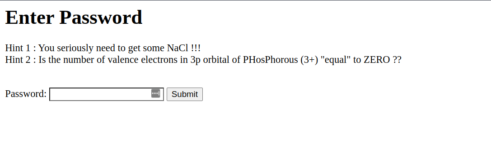

# ScientificHashes

# Description

```
Can you guess the password? Well it's time to put on the lab coat and unleash that scientific mind of yours !!

https://web.ctf.devclub.in/web/7/
```

Welcome page:




# Observation

The given hints seem to indicate that of a PHP type juggling vulnerability.
PHP will do just about anything to match with a loose comparison (==) which means things can be 'equal' (==) or really equal (===). The implicit integer parsing to strings is the root cause of a lot of issues in PHP.


We can also see that there's a cookie named `Salt` set to `f789bbc328a3d1a3`, which confirms our suspicion.
# Exploitation

```py
import hashlib

salt = "f789bbc328a3d1a3"

i = 100000000

while 1:
    password = salt + str(i)
    password = password.encode('utf8')

    new_hash = hashlib.md5(password).hexdigest()
    if new_hash[0:2] == "0e" and new_hash[2:32].isdigit():
        print(password, str(i), new_hash)
        exit(0)
    i += 1
```

On running this on an AWS instance, we get the following output after some minutes:

```
b'f789bbc328a3d1a3237701818' 237701818 0e668271403484922599527929534016
```

So, now we put this as password, and we get the flag in alert box. 

Flag: ```FLAG{php_r0cks_0nc3_again}```