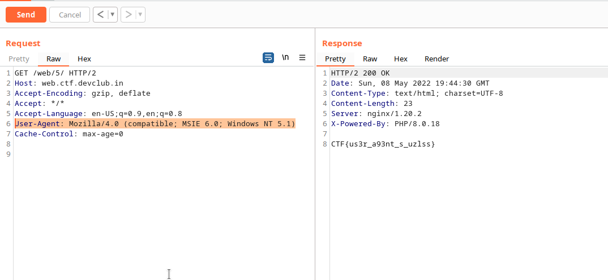

# TheGoodOldDays

# Description

```
U need a time machine

https://web.ctf.devclub.in/web/5/
```

# Observation

The web page says
```Wrong Information, Our Community Members use Old Windows Laptops. You are using a New Linux```

# Exploitation

We just need to change the User-Agent to that of some browser used in old windows laptops, for example
Internet Explorer etc. On googling more about it, we got a User-agent `User-Agent: Mozilla/4.0 (compatible; MSIE 6.0; Windows NT 5.1)`, and here we have the flag.



And here we have the flag
```CTF{us3r_a93nt_s_uzlss}```