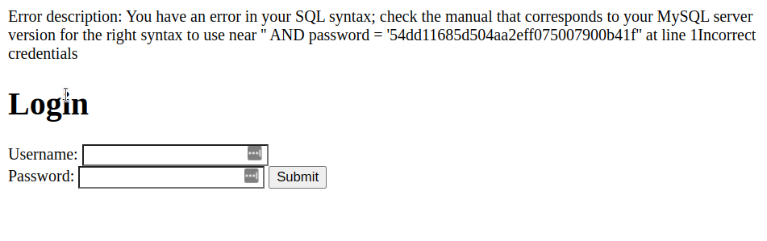
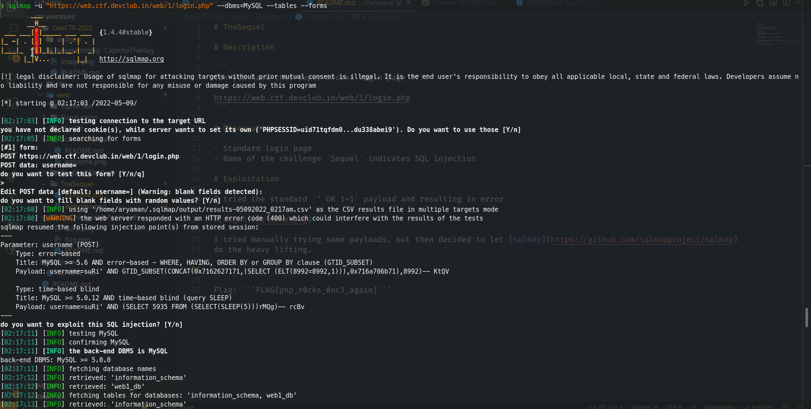
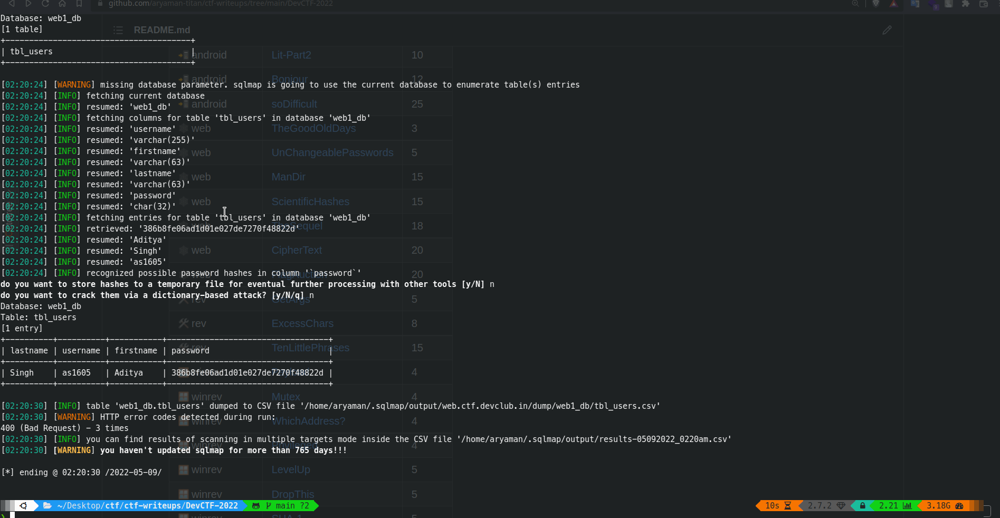
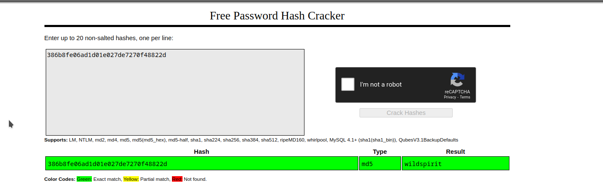

# TheSequel

# Description

```
Can you hack this super secret login page ????

https://web.ctf.devclub.in/web/1/login.php
```

# Observation

- Standard login page
- Name of the challenge `Sequel` indicates SQL injection

# Exploitation

I tried the standard `' OR 1=1` payload and resulting in error



I tried manually trying some payloads, but then decided to let [sqlmap](https://github.com/sqlmapproject/sqlmap)
do the heavy lifting. 



We see that there's a table named `tbl_users`, let's try to dump that now
using command

```
sqlmap -u "https://web.ctf.devclub.in/web/1/login.php" --dbms=MySQL --tables --forms -T tbl_users --dump 
```



Now since we have the hash of the password, let's try to get the password using [crackstation](https://crackstation.net/)



We enter the username, password using the creds retrieved, and voila...another cat in the basket!

Flag: ```CTF{7ql_1s_n0t_3asy_8_all}```