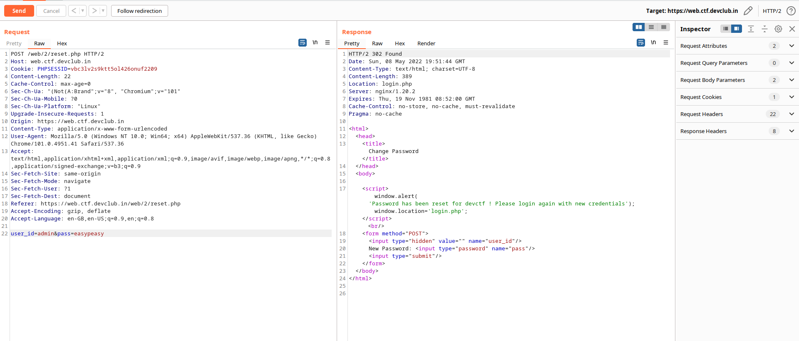
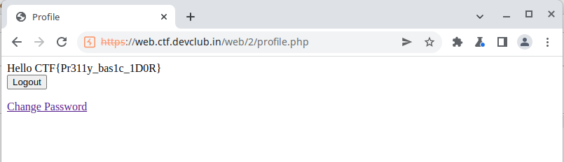

# UnChangeablePasswords

# Description

```
You can create an account ... sure. But we DARE you change the Passwords..

https://web.ctf.devclub.in/web/2/login.php
```

This was quite an easy challenge, having IDOR vulnerability where we could simple signup, login and change
our password. But where's the catch? Here's the catch:



# Observation

We see that `user_id` is also sent along with the request, and if we set it to `admin`, then we can reset it's creds

# Exploitation

We set `user_id=admin&password=easypeasy` and then login with the same creds, where we get the flag.



And here we have the flag
```CTF{Pr311y_bas1c_1D0R}```