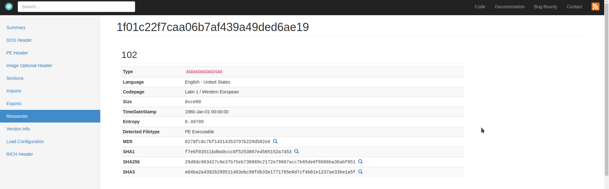

# WinRev

This category was kinda new to me. I looked for tools, found windbg and some other, but is there any binary that IDA can't reverse? Let's test xD

## Payload

In this challenge, we deal with some (malicious?) payload. The challenge need the resource name where the *payload* is located. So, I thought that `Resource` API function might have to do something with it. I browsed through the .dll using IDA Pro and found some interesting stuff.


```java
hResInfo = FindResourceW(::hModule, (LPCWSTR)0x66, L"asdasdasdasdsad");
```

Gotcha! The flag is `asdasdasdasdsad`


## Mutex

We need the name of the mutex used by malware. On decompiling the function `sub_10002300`, we can find that.

```java
hObject = CreateMutexA(0, 0, "avcjkvcnmvcnmcvnmjdfkjfd");
```

which gives the mutex name as `avcjkvcnmvcnmcvnmjdfkjfd` --> turned out to be the flag


## WhichAddress

Here, we need to get the WinAPI function, that is sent to `CreateRemoteThread API` as a 4th param at `0x10002174`

Peeking at this particular location using IDA Pro, we find the following code

```java
hHandle = CreateRemoteThread(hProcess, 0, 0, lpStartAddress, lpAddress, 0, ThreadId);

lpStartAddress = (LPTHREAD_START_ROUTINE)GetProcAddress(hModule, "LoadLibraryA");
```

`LoadLibraryA` is our required flag.


## Privileged

Here, we need to trace the privileges gained by the malware. Let's use IDA Pro. I found a function `sub_100019a0` which contains

```java
if ( OpenProcessToken(CurrentProcess, 0x28u, &TokenHandle) )
  {
    LookupPrivilegeValueA(0, "SeDebugPrivilege", &NewState.Privileges[0].Luid);
    NewState.PrivilegeCount = 1;
    NewState.Privileges[0].Attributes = 2;
    AdjustTokenPrivileges(TokenHandle, 0, &NewState, 0, 0, 0);
  }
```

Now, it's evident that privilege gained by the malware is `SeDebugPrivilege`

## DropThis

Now, we need file name of dropped payload. On decompiling the function `sub_10002250`, we find 

```java
sub_10002B3B(a3, 260, "iexplore-1.dat"); 
```                  

We have our next flag, `iexplore-1.dat`

## LevelUp

Here, we need the process which injects the dropped payload. As the injected payload was `iexplore-1.dat`, I looked up online for the process name , which resulted in `iexplore.exe`. I was not very sure of it, but I tried, and it turned out to be the flag.
## SHA1

I uploaded the dll in this site [manalyzer](https://manalyzer.org/) which gave out various details including the SHA1 hash of dropped payload `iexplore-1.dat`.



Flag: `f7e6f03511bd0a9ccc8f5253007e4505152a7453`

